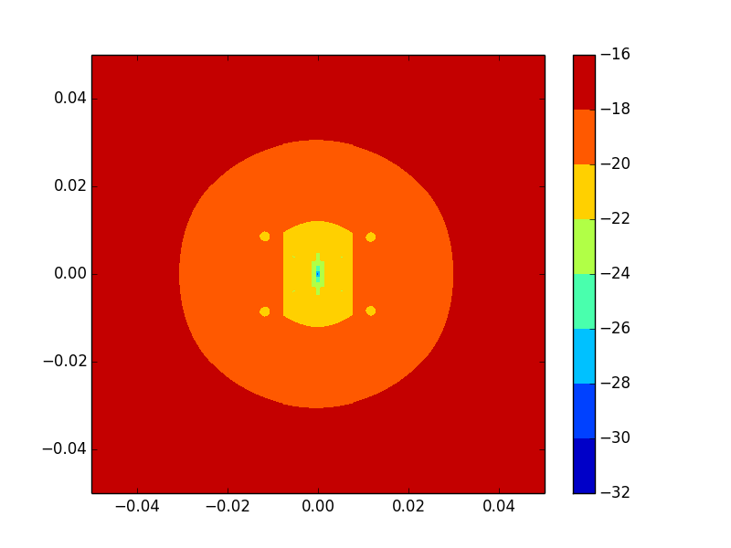
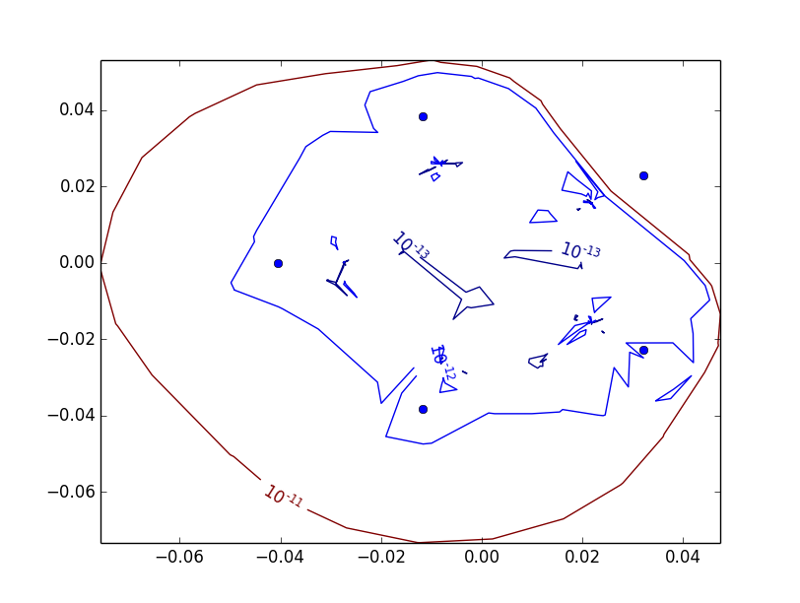

# Mpseudo [](https://travis-ci.org/scidam/mpseudo)

Mpseudo performs multicore and precise computation of pseudospectrum of a square matrix. It uses definition of matrix spectral portrait to compute epsilon-values on regular grid of complex plane.
It uses `multiprocessing` module to share computations between cpu-cores, and `mpmath` module to calculate epsilon-pseudospectra values with high precision.


##Dependencies
Probably, `mpmath` module is needed to perform computations with high precision. 

```pip install mpmath```

If you don't plan to perform high precision (more than 15 digits) pseudospectra computations, the `mpseudo` will work without `mpmath` module.
The only requirement - [NumPy](http://numpy.org). It should be installed on your system or in virtual environment.


## Installation
```git clone https://github.com/scidam/mpseudo.git```


## Example
The pseudospectrum of the gallery(5) MatLab matrix looks like this (with 100-digits precision used for resolvent computation):



The pseudospectrum above is obtained via the following lines of code:
```python
from matplotlib import pyplot
from mpseudo import pseudo

# Gallery(5) MatLab matrix (exact eigenvalue is 0 (the only!))
A = [[-9, 11, -21, 63, -252],
     [70, -69, 141, -421, 1684],
     [-575, 575, -1149, 3451, -13801],
     [3891, -3891, 7782, -23345, 93365],
     [1024, -1024, 2048, -6144, 24572]]

# compute pseudospectrum in the bounding box [-0.05,0.05,-0.05,0.05] with 
# resolution 100x100 (2 processes will be used) and 50-digits precision.
psa, X, Y = pseudo(A, ncpu=2, digits=50, ppd=100, bbox=[-0.05,0.05,-0.05,0.05])

# show results
pyplot.conourf(X, Y, psa)
pyplot.show()
```

Note, if `mpmath` module not installed, pseudospectrum of the matrix will be computed with standard (double, 15-digits) precision, which is not sufficient for this case.

It is very intresting, but [Eigtool](http://www.cs.ox.ac.uk/pseudospectra/eigtool/) or [PseudoPy](https://github.com/andrenarchy/pseudopy) tools (along with `scipy eigvals` function) applied to the matrix A in the example above lead to inaccurate results (due to insufficient precision):




## License
Mpseudo is free software licensed under the [MIT License](http://opensource.org/licenses/mit-license.php).
